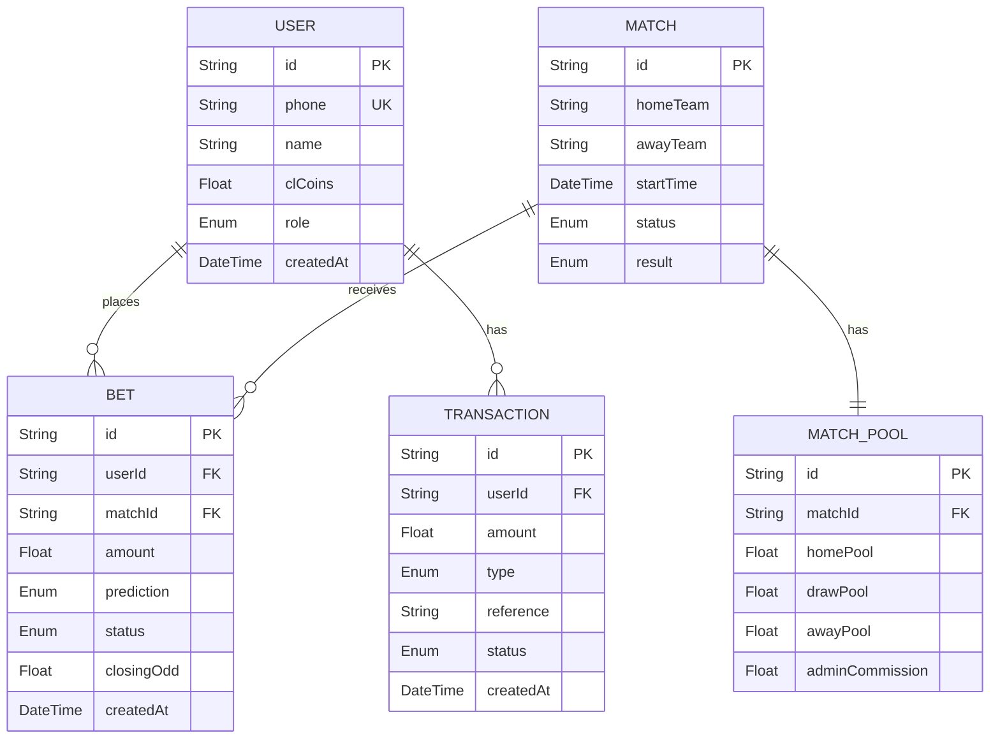

# 📋 ERS — Software Requirements Specification (SRS)
# **CLUB 90 — Plataforma de Pronósticos Deportivos Pari-Mutuel**

> **Versión:** 1.0  
> **Fecha:** 2026-03-30  
> **Autor:** Antigravity Core Engine (Solutions Architect)  
> **Estado:** En Revisión por Scrum Master  

---

## 1. Executive Summary

**Club 90** es una aplicación web móvil de pronósticos deportivos que opera bajo el modelo financiero **Pari-Mutuel (Fondo Común)**, donde los jugadores compiten entre sí y la casa retiene una comisión fija del **20%**. El sistema utiliza una moneda virtual llamada **CL COINS** — eliminando regulaciones de apuestas con dinero real — y se integra con **WhatsApp** para automatizar recargas vía comprobantes de pago analizados por GPT-4 Vision.

El valor de negocio radica en crear una experiencia de entretenimiento social y competitivo con estética premium (inspirada en Stake.com), cuotas dinámicas en tiempo real, y un sistema de ranking que fomenta la retención y el engagement mediante mecánicas de gamificación.

---

## 2. User Actors & Roles

| Actor | Rol | Permisos Clave |
|-------|-----|----------------|
| **PLAYER** | Jugador/Apostador | Ver partidos, colocar pronósticos, ver ranking, consultar saldo, solicitar recargas vía WhatsApp |
| **ADMIN** | Administrador de la plataforma | Crear/editar partidos, cerrar mercados, liquidar resultados, gestionar comisiones, administrar usuarios |
| **WhatsApp Bot** | Agente automatizado | Recibir comprobantes de pago, validar montos (vía GPT-4 Vision), acreditar CL COINS automáticamente |
| **Sistema (Cron/Scheduler)** | Proceso automático | Cerrar mercados 15 min antes del inicio, recalcular cuotas en tiempo real |

---

## 3. Functional Requirements (The "Must-Haves")

### 🗄️ CAPA 1 — Base de Datos

| ID | Requisito |
|----|-----------|
| **REQ-01** | System SHALL persist users with unique phone numbers (cross-referenced with WhatsApp), name, CL COINS balance, and role (PLAYER/ADMIN). |
| **REQ-02** | System SHALL store matches with home/away teams, start time, status lifecycle (OPEN → CLOSED → FINISHED), and final result (HOME_WIN, DRAW, AWAY_WIN, PENDING). |
| **REQ-03** | System SHALL maintain a unique `MatchPool` per match tracking three separate pools (homePool, drawPool, awayPool) and the extracted admin commission (20%). |
| **REQ-04** | System SHALL record every bet with user reference, match reference, amount, prediction, status (PENDING/WON/LOST), and the closing odd at settlement time. |
| **REQ-05** | System SHALL log all financial movements as `Transaction` records with type (DEPOSIT, BET_PLACED, WINNINGS_PAID), optional reference, and approval status. |
| **REQ-06** | System SHALL enforce all 1:N relationships: User→Bets, User→Transactions, Match→Bets, Match→MatchPool (1:1). |

---

### ⚙️ CAPA 2 — Lógica de Negocio y Seguridad (Backend)

| ID | Requisito |
|----|-----------|
| **REQ-07** | System SHALL calculate live Pari-Mutuel odds using the formula: `odd = netPool / (pool_option + SEED_LIQUIDITY)`, where `netPool = grossPool * (1 - 0.20)` and `SEED_LIQUIDITY = 10,000 CL COINS` per option. |
| **REQ-08** | System SHALL guarantee a minimum odd of **1.05** via `Math.max(1.05, odd)` to prevent sub-even payouts. All odds SHALL be rounded to 2 decimal places. |
| **REQ-09** | System SHALL validate that a user has sufficient CL COINS balance before accepting any bet placement. |
| **REQ-10** | System SHALL **reject** any bet on a match that is NOT in `OPEN` status. |
| **REQ-11** | System SHALL **reject** any bet placed within **15 minutes** of the match's `startTime` ("Mercado Cerrado" rule). |
| **REQ-12** | System SHALL execute bet placement as an **atomic database transaction** (Prisma `$transaction`): deduct user balance → update match pool → create Bet record → create Transaction record. |
| **REQ-13** | System SHALL settle matches by: updating match status to FINISHED, calculating final odds, extracting 20% commission to `MatchPool.adminCommission`, distributing winnings to correct bettors (amount × closing odd), and marking bets as WON/LOST. |
| **REQ-14** | System SHALL integrate with WhatsApp via `handleTopUpReceipt(userPhone, extractedAmount)` to auto-create users and credit CL COINS deposits with APPROVED status. |
| **REQ-15** | System SHALL return a confirmation message in Spanish: *"✅ ¡Recarga exitosa! Se han añadido [Monto] CL COINS a tu cuenta en Club 90. ¡Ve por el primer puesto en el ranking!"* |
| **REQ-16** | System SHALL use parameterized queries (ORM) exclusively. No raw SQL. All secrets via `process.env`. |

---

### 🎨 CAPA 3 — Frontend (UI/UX)

| ID | Requisito |
|----|-----------|
| **REQ-17** | System SHALL render a mobile-first layout with a **dark theme** using the strict palette: `#0f212e` (app bg), `#1a2c38` (cards), `#2f4553` (secondary buttons), `#1475e1` (accent blue), `#00e701` (neon green), `#b1bad3` (secondary text). |
| **REQ-18** | System SHALL display a fixed **TopNavbar** with "CLUB 90" branding (bold italic) and a balance capsule showing `🪙 [Balance] CL` with a blue "+" recharge button linking to WhatsApp. |
| **REQ-19** | System SHALL display a fixed **BottomNavBar** with 4 navigation icons: Partidos, Tickets, Ranking, Perfil. |
| **REQ-20** | System SHALL render **MatchCards** showing: date, "Mercado Abierto" badge with pulsing green dot, team names, and a 3-column odds grid (1, X, 2) with hover/active blue highlight. |
| **REQ-21** | System SHALL display a **BetSlip** bottom sheet upon odds selection, containing: selected team + odd in neon green, a numeric input field, quick-add buttons (+1K, +5K, MAX), and a real-time "Retorno Estimado" calculation in large neon green text. |
| **REQ-22** | System SHALL include a Pari-Mutuel disclaimer: *"Modalidad Pari-Mutuel: El multiplicador final se ajusta al inicio del partido."* |
| **REQ-23** | System SHALL display a full-width neon green CTA button: **"CONFIRMAR PRONÓSTICO 🚀"**. |
| **REQ-24** | System SHALL render a **Leaderboard** view with top 10 users, medal icons (🥇🥈🥉) for top 3, balances in neon green, and a highlighted row for the current user (blue border + distinct background). |
| **REQ-25** | System SHALL support navigation between `HomeFeed` and `Leaderboard` via the `BottomNavBar`. |

---

## 4. Data Entities



### Enums

| Enum Name | Values |
|-----------|--------|
| `Role` | `PLAYER`, `ADMIN` |
| `MatchStatus` | `OPEN`, `CLOSED`, `FINISHED` |
| `MatchResult` | `HOME_WIN`, `DRAW`, `AWAY_WIN`, `PENDING` |
| `BetStatus` | `PENDING`, `WON`, `LOST` |
| `TransactionType` | `DEPOSIT`, `BET_PLACED`, `WINNINGS_PAID` |
| `TransactionStatus` | `PENDING`, `APPROVED` |

---

## 5. Recommended Technical Stack

| Layer | Technology | Justificación |
|-------|-----------|---------------|
| **Frontend** | React 18 + Tailwind CSS + Vite | React para SPA reactiva con estado complejo (BetSlip en tiempo real). Tailwind para replicar pixel-perfect la paleta Stake.com. Vite por HMR ultra-rápido en dev. *(Delegado a KIMI CODE)* |
| **Backend** | Node.js + Express + TypeScript | TypeScript para type-safety en lógica financiera crítica (cálculo de odds). Express por simplicidad y ecosistema maduro de middlewares. |
| **ORM** | Prisma | Type-safe queries, migraciones declarativas, transacciones atómicas nativas (`$transaction`). Ideal para la integridad financiera de CL COINS. |
| **Database** | PostgreSQL | ACID compliance obligatorio para transacciones financieras. Soporte nativo de enums y tipos complejos. Escalable. |
| **Integración** | WhatsApp Business API + GPT-4 Vision | Flujo automatizado de recargas: comprobante → validación IA → acreditación. Ya validado en el proyecto existente ([ERS_chatbot_pagos_reservas.md](file:///c:/Users/LENOVO%20CORP/Club%2090/ERS_chatbot_pagos_reservas.md)). |
| **Hosting** | Vercel (Frontend) + Railway/Render (Backend + DB) | Deploy instantáneo, SSL automático, tier gratuito para MVP. |

---

## 6. Sprint Plan — Ejecución Ágil

> **Duración del Sprint:** 1 semana por sprint  
> **Velocidad Estimada:** ~25 Story Points por sprint  
> **Total Estimado:** 4 Sprints (1 mes)

---

### 🟢 SPRINT 1 — "La Base" (Database + Core Services)
> **Objetivo:** Infraestructura de datos y motor matemático Pari-Mutuel operativo.

| # | Task | Story Points | Prompt Ref | Owner |
|---|------|:---:|:---:|:---:|
| 1.1 | Inicializar proyecto Node.js + TypeScript + Express + Prisma | 3 | — | **Antigravity** |
| 1.2 | Crear `schema.prisma` con 5 modelos, enums y relaciones | 5 | Prompt 1 | **Antigravity** |
| 1.3 | Ejecutar migración inicial (`prisma migrate dev`) | 2 | Prompt 1 | **Antigravity** |
| 1.4 | Implementar `odds.service.ts` (cálculo Pari-Mutuel con seed liquidity) | 5 | Prompt 2 | **Antigravity** |
| 1.5 | Implementar `betting.service.ts` — `placeBet()` con validaciones y `$transaction` | 8 | Prompt 3 | **Antigravity** |
| 1.6 | Implementar `betting.service.ts` — `settleMatch()` con liquidación y comisión | 8 | Prompt 3 | **Antigravity** |

**Total SP:** 31 | **Sprint Goal:** Motor de negocio 100% funcional y testeado via unit tests.

#### ✅ Criterios de Aceptación — Sprint 1
- [ ] `schema.prisma` compila sin errores y tablas creadas en PostgreSQL
- [ ] `calculateLiveOdds()` retorna cuotas ≥ 1.05 para cualquier input (incluido pools en 0)
- [ ] `placeBet()` rechaza apuestas con saldo insuficiente
- [ ] `placeBet()` rechaza apuestas a < 15 min del inicio
- [ ] `placeBet()` ejecuta transacción atómica correctamente
- [ ] `settleMatch()` distribuye premios correctamente y extrae comisión del 20%
- [ ] Unit tests pasan al 100%

---

### 🟡 SPRINT 2 — "La Conexión" (API REST + WhatsApp Integration)
> **Objetivo:** Exponer la lógica como API y conectar el flujo de recargas WhatsApp.

| # | Task | Story Points | Prompt Ref | Owner |
|---|------|:---:|:---:|:---:|
| 2.1 | Crear rutas API REST: `POST /api/bets`, `GET /api/matches`, `GET /api/odds/:matchId` | 5 | — | **Antigravity** |
| 2.2 | Crear rutas API REST: `POST /api/matches` (Admin), `PUT /api/matches/:id/settle` (Admin) | 5 | — | **Antigravity** |
| 2.3 | Crear ruta `GET /api/leaderboard` (Top 10 por clCoins) | 3 | — | **Antigravity** |
| 2.4 | Implementar `whatsapp.controller.ts` — `handleTopUpReceipt()` | 5 | Prompt 4 | **Antigravity** |
| 2.5 | Middleware de autenticación básico (JWT o API Key por phone) | 5 | — | **Antigravity** |
| 2.6 | Middleware de autorización por rol (ADMIN gates) | 3 | — | **Antigravity** |
| 2.7 | Validación de inputs con Zod en todas las rutas | 3 | — | **Antigravity** |

**Total SP:** 29 | **Sprint Goal:** API completa, documentada y protegida. WhatsApp acredita CL COINS.

#### ✅ Criterios de Aceptación — Sprint 2
- [ ] `POST /api/bets` crea apuesta y retorna bet + odds actualizadas
- [ ] `PUT /api/matches/:id/settle` liquida partido correctamente (solo ADMIN)
- [ ] `handleTopUpReceipt()` crea usuario si no existe y acredita CL COINS
- [ ] Mensaje de confirmación en español retornado correctamente
- [ ] Rutas protegidas rechazan requests sin auth
- [ ] Inputs inválidos retornan errores descriptivos (Zod)

---

### 🔵 SPRINT 3 — "La Ilusión" (Frontend UI Completo)
> **Objetivo:** Interfaz móvil premium con estética Stake.com. 100% funcional con mock data.

| # | Task | Story Points | Prompt Ref | Owner |
|---|------|:---:|:---:|:---:|
| 3.1 | Inicializar proyecto React + Vite + Tailwind CSS | 3 | — | **KIMI CODE** |
| 3.2 | Implementar `AppLayout.tsx` (flex-col, h-screen, dark mode) | 3 | Prompt 5 | **KIMI CODE** |
| 3.3 | Implementar `TopNavbar.tsx` (branding, saldo, botón recarga WhatsApp) | 3 | Prompt 5 | **KIMI CODE** |
| 3.4 | Implementar `BottomNavBar.tsx` (4 iconos con navegación) | 3 | Prompt 5 | **KIMI CODE** |
| 3.5 | Implementar `MatchCard.tsx` (tarjeta con cuotas y estado) | 5 | Prompt 6 | **KIMI CODE** |
| 3.6 | Implementar `HomeFeed.tsx` (lista de partidos con mock data) | 3 | Prompt 6 | **KIMI CODE** |
| 3.7 | Implementar `BetSlip.tsx` (bottom sheet con cálculo reactivo) | 8 | Prompt 7 | **KIMI CODE** |
| 3.8 | Implementar `Leaderboard.tsx` (ranking con medallas y highlight) | 5 | Prompt 8 | **KIMI CODE** |
| 3.9 | Conectar navegación completa (BottomNavBar ↔ Views) | 2 | Prompt 8 | **KIMI CODE** |

**Total SP:** 35 | **Sprint Goal:** UI pixel-perfect con datos mock. Flujo completo: ver partidos → seleccionar cuota → BetSlip → confirmar.

#### ✅ Criterios de Aceptación — Sprint 3
- [ ] App usa exactamente la paleta HEX definida (sin desviaciones)
- [ ] TopNavbar muestra saldo y botón "+" enlaza a WhatsApp
- [ ] MatchCards muestran cuotas con hover/active en azul `#1475e1`
- [ ] BetSlip desliza desde abajo, calcula retorno en tiempo real
- [ ] Botones rápidos (+1K, +5K, MAX) funcionan correctamente
- [ ] Leaderboard muestra Top 10 con medallas y fila del usuario resaltada
- [ ] Navegación entre HomeFeed ↔ Leaderboard funcional
- [ ] Responsive en pantallas de 360px a 428px (móviles)

---

### 🟣 SPRINT 4 — "El Zarpazo" (Integration + Polish + Deploy)
> **Objetivo:** Conectar frontend con backend real, testing E2E, y deploy a producción.

| # | Task | Story Points | Prompt Ref | Owner |
|---|------|:---:|:---:|:---:|
| 4.1 | Conectar Frontend a API real (reemplazar mock data) | 5 | — | **KIMI CODE** |
| 4.2 | Implementar estado global (Zustand/Context) para user session y balance | 5 | — | **KIMI CODE** |
| 4.3 | Manejo de errores y loading states en UI | 3 | — | **KIMI CODE** |
| 4.4 | Testing E2E del flujo completo: Login → Ver partido → Apostar → Liquidar | 5 | — | **Antigravity** |
| 4.5 | Testing de edge cases: saldo 0, mercado cerrado, cuotas mínimas | 3 | — | **Antigravity** |
| 4.6 | Seed de datos: crear 5 partidos de ejemplo y 10 usuarios para demo | 2 | — | **Antigravity** |
| 4.7 | Deploy Backend a Railway/Render + PostgreSQL | 3 | — | **Antigravity** |
| 4.8 | Deploy Frontend a Vercel | 2 | — | **KIMI CODE** |
| 4.9 | Configurar variables de entorno de producción | 1 | — | **Antigravity** |

**Total SP:** 29 | **Sprint Goal:** App desplegada, funcional end-to-end, y lista para demo con usuarios reales.

#### ✅ Criterios de Aceptación — Sprint 4
- [ ] Frontend consume API real sin errores
- [ ] Flujo completo funciona: recarga WhatsApp → ver partido → apostar → liquidar → ver ranking
- [ ] Errores se muestran con mensajes en español al usuario
- [ ] App deployed y accesible vía URL pública
- [ ] Demo exitosa con 5+ partidos y 10+ usuarios simulados

---

## 7. Risk Register

| Riesgo | Probabilidad | Impacto | Mitigación |
|--------|:---:|:---:|-----------|
| Cuotas Pari-Mutuel generan payouts negativos/inválidos | Media | **Crítico** | `SEED_LIQUIDITY` de 10K y `Math.max(1.05)` como floor |
| Race conditions en apuestas simultáneas | Alta | **Alto** | `prisma.$transaction` con isolation level `Serializable` |
| WhatsApp API rate limiting | Media | Medio | Queue system (Bull/BullMQ) para procesamiento de comprobantes |
| Jugadores explotan cuotas antes de actualización | Baja | Medio | Cierre automático 15 min antes del partido |

---

## 8. Definition of Done (DoD)

Una feature se considera **DONE** cuando:

- [x] Código implementado y reviewado
- [x] Unit tests escritos y pasando (≥80% coverage en servicios)
- [x] Integración con Prisma/DB verificada
- [x] Textos de UI en **Español Latinoamericano**
- [x] Variables/funciones en **Inglés**
- [x] Sin secrets hardcodeados
- [x] Documentación de API actualizada (si aplica)

---

## 9. JSON Contract — Interfaz Antigravity ↔ KIMI CODE

> [!IMPORTANT]
> Este es el contrato de datos que KIMI CODE debe consumir desde la API. **Ningún campo puede ser renombrado sin aprobación del Scrum Master.**

### Match Response
```json
{
  "id": "clx123...",
  "homeTeam": "Barcelona",
  "awayTeam": "Real Madrid",
  "startTime": "2026-04-05T20:00:00Z",
  "status": "OPEN",
  "result": "PENDING",
  "odds": {
    "home": 2.45,
    "draw": 3.10,
    "away": 2.80
  },
  "pool": {
    "homePool": 15000,
    "drawPool": 8000,
    "awayPool": 12000
  }
}
```

### Place Bet Request
```json
{
  "matchId": "clx123...",
  "prediction": "HOME_WIN",
  "amount": 5000
}
```

### Bet Response
```json
{
  "id": "bet_abc...",
  "matchId": "clx123...",
  "prediction": "HOME_WIN",
  "amount": 5000,
  "currentOdd": 2.45,
  "estimatedReturn": 12250,
  "status": "PENDING"
}
```

### Leaderboard Response
```json
{
  "rankings": [
    {
      "position": 1,
      "userId": "usr_001",
      "name": "El Zarpazo",
      "clCoins": 125000,
      "isCurrentUser": false
    }
  ]
}
```

---

> [!NOTE]
> **Próximo paso:** Aprobación del Scrum Master para iniciar **Sprint 1**. Una vez aprobado, se creará el `task.md` con el breakdown detallado y se comenzará con la inicialización del proyecto y el `schema.prisma`.
